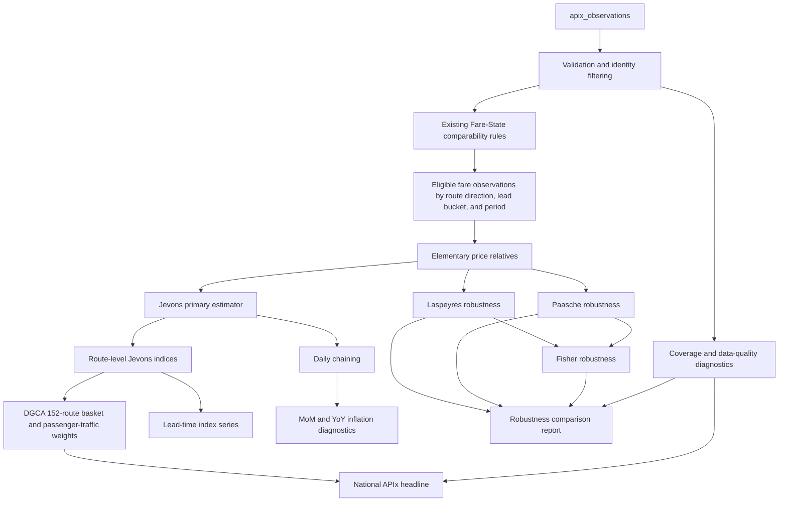

# APIx Index Engine Methodology Lock

## A. Methodology Specification

### 1. Price observation

A price observation is one validated canonical record in `apix_observations` with a usable `total_fare`, route, departure identity, search timestamp, and provenance.

- **Primary observed consumer price:** `total_fare`.
- `total_fare` is preferred over reconstructing a price from components. `base_fare`, `taxes`, and `total_fees` remain diagnostic components where present.
- A fare is identified using the existing fare identity hierarchy:
  1. `fare_availability_key` when both records provide it.
  2. `source_offer_id` when availability keys are unavailable.
  3. The combination of `fare_product_class`, `fare_class`, and `fare_family` as the fallback identity.
- `passenger_type` is part of comparability. Records with two populated, different passenger types are not comparable. If one passenger type is missing, the existing Fare-State missing-value convention allows comparison without inventing a passenger type.
- `fare_family` and `fare_class` describe the product being measured. A fare-family or fare-class change is not silently treated as the same product when the stronger fare identity fields show a different product. Churn is retained as a coverage/matching limitation and must be reported.
- Sold-out or missing-fare records are not usable price observations for price-relative estimation. They remain useful for availability-state diagnostics and are not silently converted to zero prices.

### 2. Comparable fare between snapshots

Comparability reuses the existing Fare-State `comparable_pair()` logic. No separate index-specific matching algorithm is introduced.

Two observations are comparable only when the existing rules establish:

- same source;
- same origin and destination;
- same departure calendar date;
- same target lead-time bucket when both `target_lead_days` values are populated;
- compatible carrier identity when both carrier codes are present;
- exact flight-number identity when both flight numbers are present;
- otherwise, compatible departure and arrival timing under the existing Fare-State fallback;
- compatible passenger type;
- compatible fare identity using availability key, source offer ID, or the fare product/class/family fallback.

If either `target_lead_days` value is missing, the existing missing-value philosophy is preserved; no lead-time value is invented. Such records must remain visible in data-quality diagnostics.

Missing fares remain non-price-checkable. Missing availability is treated as unknown for availability analytics, never as a numeric fare. Fare-family churn that breaks identity reduces comparable coverage rather than being force-matched.

### 3. Index population and units

The elementary unit is a comparable fare identity within a route, direction, source, passenger type, fare product, and target lead-time bucket. The index population must be filtered to valid, non-sold, positive, finite `total_fare` observations with sufficient identity and provenance.

Repeated observations from the same collection run are not separate time periods. A period is defined by the observation/search date or an explicitly selected time bucket; the period construction must not use scheduler completion time as a substitute for observation time.

### 4. Route direction

Directional observations remain separate. `DEL -> BOM` and `BOM -> DEL` are different route directions unless a future, explicitly approved methodology defines a symmetric route treatment. No routes are randomly added to the basket.

### 5. Missing route observations

A route with no valid price observations for a period is missing for that period. It is not assigned a zero, copied fare, or fabricated index. National aggregation uses the published DGCA weights over the routes with valid current and required comparison data, and reports coverage and the weight represented by those routes.

A headline national value must not be presented without its route coverage diagnostics.

## B. Mathematical Formulas

### 1. Elementary price relative

For comparable fare identity $i$ between periods $t-1$ and $t$:

$$
r_{i,t} = \frac{p_{i,t}}{p_{i,t-1}}
$$

where $p_{i,t}$ is positive, finite `total_fare`. If either price is missing, non-positive, or non-finite, $r_{i,t}$ is not calculable and is excluded from the price-relative estimator while being counted in data-quality diagnostics.

### 2. Primary elementary estimator: Jevons

For $n_t$ comparable price relatives in period $t$:

$$
J_t = \left(\prod_{i=1}^{n_t} r_{i,t}\right)^{1/n_t}
$$

For numerical stability, implementation should use the log form:

$$
\ln J_t = \frac{1}{n_t}\sum_{i=1}^{n_t}\ln(r_{i,t})
$$

The Jevons estimator is the primary APIx elementary estimator because it measures proportional fare movement and prevents high-fare observations from dominating through absolute-level addition.

### 3. Laspeyres robustness estimator

Using previous-period expenditure or quantity weights $w_{i,t-1}$, normalized so that $\sum_i w_{i,t-1}=1$:

$$
L_t = \sum_{i=1}^{n_t} w_{i,t-1} r_{i,t}
$$

Equivalently, with base-period quantities $q_{i,t-1}$:

$$
L_t = \frac{\sum_i p_{i,t}q_{i,t-1}}{\sum_i p_{i,t-1}q_{i,t-1}}
$$

Where no defensible expenditure or quantity weights exist, Laspeyres is reported as unavailable rather than assigned arbitrary equal weights without disclosure.

### 4. Paasche robustness estimator

Using current-period expenditure or quantity weights $w_{i,t}$, normalized so that $\sum_i w_{i,t}=1$:

$$
P_t = \frac{1}{\sum_i w_{i,t}/r_{i,t}}
$$

Equivalently, with current-period quantities $q_{i,t}$:

$$
P_t = \frac{\sum_i p_{i,t}q_{i,t}}{\sum_i p_{i,t-1}q_{i,t}}
$$

As with Laspeyres, unavailable quantity/expenditure weights must produce an explicit unavailable result, not a fabricated weight.

### 5. Fisher robustness estimator

The Fisher estimator is the geometric mean of Laspeyres and Paasche:

$$
F_t = \sqrt{L_tP_t}
$$

Fisher is available only when both component estimators are valid.

### 6. Route-level aggregation

For route $r$, direction $d$, lead-time bucket $b$, and period $t$, calculate a route-level Jevons relative from valid comparable fares in that slice:

$$
J_{r,d,b,t} = \left(\prod_{i\in(r,d,b)} r_{i,t}\right)^{1/n_{r,d,b,t}}
$$

The route-level index is chained from a fixed conceptual base scale of 100:

$$
I_{r,d,b,t} = I_{r,d,b,t-1} \times J_{r,d,b,t}
$$

with the selected base period defined as $I_{r,d,b,0}=100$. The route weight comes from the existing DGCA route basket and `route_weight_pct` / passenger-traffic weights. The 152-route core basket is authoritative.

### 7. National APIx

The headline national APIx is the DGCA-weighted aggregation of route-level Jevons indices:

$$
APIx_t =
\frac{\sum_{r\in R_t} W_r I_{r,t}}
{\sum_{r\in R_t} W_r}
$$

where $W_r$ is the existing DGCA passenger-traffic route weight and $R_t$ is the set of routes with valid route-level indices for the required period. The headline estimator is therefore **DGCA-weighted route-level Jevons**.

The report must include:

- routes represented;
- represented weight share;
- missing route count;
- quality/coverage flag;
- the base-period definition.

No route is added solely to improve coverage.

### 8. Lead-time indices

Lead-time buckets are separate analytical dimensions:

- `T+1` = `target_lead_days = 1`;
- `T+7` = `target_lead_days = 7`;
- `T+15` = `target_lead_days = 15`;
- `T+30` = `target_lead_days = 30`;
- `T+45` = `target_lead_days = 45`.

Each bucket has its own route-level and national series when data exists. A lead-time series does not redefine the overall APIx base. The overall headline series is a separate aggregation over its declared lead-time treatment. A missing bucket is reported as unavailable, not imputed from another bucket.

### 9. Time, chaining, and inflation

An index level and an inflation rate are different quantities.

Daily chaining uses the period price relative:

$$
I_t = I_{t-1}\times J_t
$$

The conceptual base remains fixed at the declared base period and scale, commonly 100. It is not reset to 100 each day.

Month-over-month inflation is calculated from index levels:

$$
MoM_t = \left(\frac{I_t}{I_{t-1}}-1\right)\times100
$$

Year-over-year inflation is calculated against the comparable index level twelve months earlier:

$$
YoY_t = \left(\frac{I_t}{I_{t-12}}-1\right)\times100
$$

For daily data, the equivalent prior-year comparison is the defined 365-day or calendar-date comparison, which must be selected consistently and documented. No YoY claim is made without the required historical depth.

### 10. Robustness estimators

Jevons, Laspeyres, Paasche, and Fisher are compared on the same eligible population and time slice whenever their required inputs exist. They are diagnostic/robustness estimators, not four separate headline APIx values.

The published headline remains DGCA-weighted route-level Jevons. Robustness output should show estimator levels, changes, absolute differences from Jevons, coverage, and unavailable-input reasons. Divergence is a methodology diagnostic, not permission to select whichever estimator gives the preferred result.

## C. Data-Flow Diagram

## D. Explicit Assumptions and Edge Cases

1. **Current data limitation:** the real SQLite database contains repeated collection runs from the current day, not a genuine 30-day historical airfare dataset.
2. **No backtest claim:** current repeated runs may validate plumbing and read-only diagnostics, but they cannot support a 30-day backtest or historical market conclusion.
3. **Synthetic methodology tests:** unit tests use synthetic historical observations and isolated databases/objects. Synthetic data must not be inserted into the production database.
4. **Production DB testing:** initial real-database testing is read-only diagnostics only.
5. **Fare validity:** null, zero, negative, non-numeric, or non-finite `total_fare` values cannot form price relatives.
6. **Availability:** sold-out or unknown availability is retained for state diagnostics but excluded from price-level calculations when no valid consumer fare exists.
7. **Lead time:** populated lead-time buckets must match exactly for repeated-snapshot comparisons. `T+1` never matches `T+7`, `T+30`, or `T+45`.
8. **Missing lead time:** missing lead time is not replaced with a guessed bucket. It is reported as an unknown dimension and excluded from bucket-specific claims where a bucket is required.
9. **Fare-family churn:** a changed fare family, class, offer, or availability identity is a product change/coverage event unless the existing matching hierarchy establishes comparability.
10. **Passenger type:** passenger-specific prices remain separate unless a future methodology explicitly defines an aggregation. No mixing adult, child, infant, or other passenger types silently.
11. **Direction:** origin/destination direction remains explicit.
12. **Route coverage:** missing routes are not assigned zero movement or copied movement. National coverage is reported with the represented DGCA weight.
13. **Duplicate observations:** duplicate or repeated records are removed or excluded according to the existing validated observation/storage conventions before index estimation; duplicate counts remain in diagnostics.
14. **Timestamp:** observation/search timestamps define temporal ordering. Scheduler run completion timestamps do not substitute for search timestamps.
15. **Base period:** the base period and scale are declared once for a series. Daily chaining does not reset the base.
16. **Inflation vs level:** an index level of 100 is not an inflation rate. MoM and YoY are percentage changes between index levels.
17. **Estimator availability:** Laspeyres, Paasche, and Fisher require defensible quantity/expenditure weights. They are not forced when those inputs are absent.
18. **No substantive market claim:** a zero observed FEP over a short interval means no upward fare transitions were observed in that interval; it does not mean fares are generally stable.

## E. Implementation Checklist for Steps 1-10

- [ ] Lock the declared base period, base scale, frequency, and timezone/date policy.
- [ ] Implement a read-only validated observation adapter using existing canonical fields.
- [ ] Reuse Fare-State comparability and preserve source, route direction, passenger type, fare identity, and target lead-time boundaries.
- [ ] Define period buckets from observation/search timestamps without using scheduler completion time.
- [ ] Implement positive finite `total_fare` eligibility and explicit missing-data diagnostics.
- [ ] Construct elementary price relatives for eligible repeated fare identities.
- [ ] Implement route-direction-lead-time Jevons as the primary estimator.
- [ ] Implement Laspeyres, Paasche, and Fisher only with documented defensible weights.
- [ ] Load the existing 152-route DGCA basket and passenger-traffic weights; verify weight coverage and normalization.
- [ ] Aggregate route-level Jevons indices to the headline national APIx.
- [ ] Produce separate T+1, T+7, T+15, T+30, and T+45 series without changing the overall base.
- [ ] Implement daily chaining while preserving the fixed conceptual base.
- [ ] Calculate MoM and YoY inflation only when the required prior periods exist.
- [ ] Add route coverage, lead-time coverage, fare-family churn, duplicate, missing-fare, and timestamp diagnostics.
- [ ] Compare robustness estimators against Jevons in a diagnostic report, never as alternate headlines.
- [ ] Use synthetic historical fixtures for methodology and unit tests.
- [ ] Keep production database tests read-only until an explicit write plan is approved.
- [ ] Validate that no implementation creates fabricated historical observations.
- [ ] Document the distinction between plumbing validation and a genuine historical backtest.
